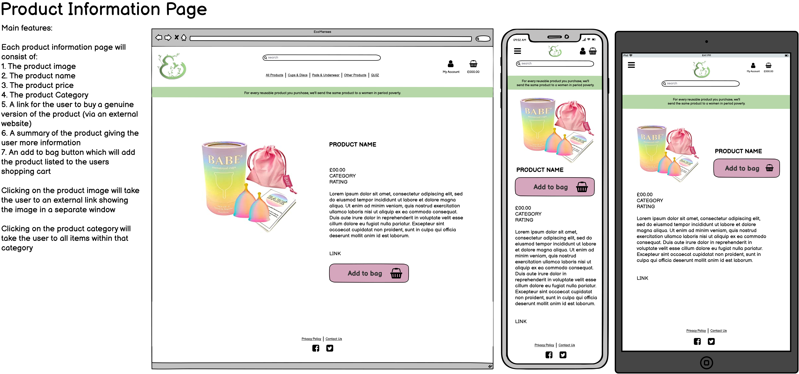
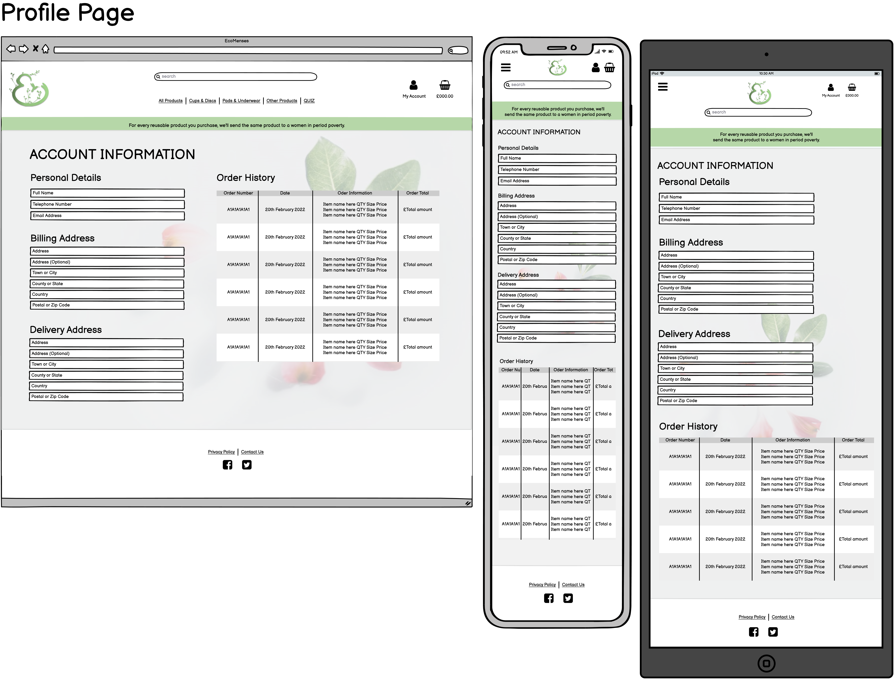
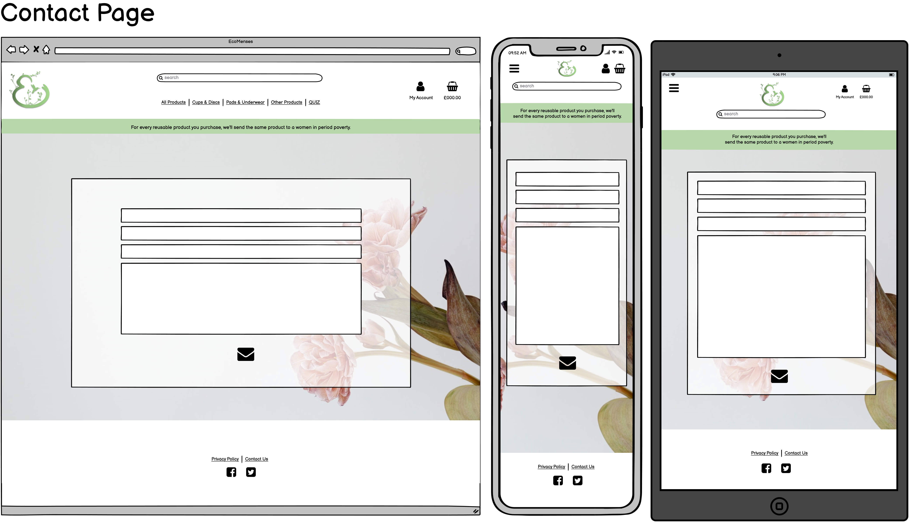

# PROJECT TITLE HERE

## Contents
<ul>
    <li>
        <a href="#Introduction"><strong>Introduction</strong></a>
    </li>
    <li>
        <a href="#UX"><strong>UX</strong></a>               
    </li>
    <li>
        <a href="#Technologies"><strong>Technologies</strong></a>
    </li>
    <li>
        <a href="#Features"><strong>Features</strong></a>
    </li>
    <li>
        <a href="#Testing"><strong>Testing</strong></a>   
    </li>
    <li>
        <a href="#Deployment"><strong>Deployment</strong></a>
    </li>
    <li>
       <a href="#Credits"><strong>Credits</strong></a> 
    </li>
    <li>
        <a href="#Screenshots"><strong>Screenshots</strong></a>
    </li>
</ul>

## Introduction

Portfolio Project Five: E-Commerce - Code Institute - Deadline 29th April 2022

This is my submission for Code Institute's (5P) Portfolio Project Five. It will be a progressive web application with the main purpose of providing and selling resusable and sustainable sanitary products. It will also provide a limited educational service to users, allowing them to learn more about the sustainable menstrual product industry and the impact of menstrual product waste on the environment. At the moment in the UK there is no online shop with the specific use of selling reusable menstrual products, there are plenty of shops that sell them along with other items (such as Amazon and eBay) but nothing that provides a one-stop-shop experience - I hope to fill this niche with the EcoMenses brand. An important reason that puts individuals off trying out reusable menstrual products is that they aren't sure which product is going to be right for them, I am going to try and combat this by providing users with an online questionnaire which will give the user recommendations for their sustainable menstrual product journey.

### Demo
A live of the website can be found <a href="#"><strong>HERE</strong></a> [INSERT LINK TO DEPLOYED SITE HERE]
[Insert responsive gif/image here]

## UX

As more people rely on accessing services online the role of UX design has become increasingly important in our digitized world. The five planes provide a conceptual framework for breaking down the task of designing experiences into component elements so that we can understand the problem as a whole. As this framework is structured, extensively used and consistently reliable, I have chosen to use the Five Planes method to design and implement my own website.

### Strategy

#### Vision

VISION OF THE PROJECT HERE (ABOUT 15 LINES)

#### Aims

<ol>
  <li>AIM 1</li>
  <li>AIM 12</li>
  <li>AIM 3</li>
  <li>MORE AIMS...</li>
</ol>

#### Target Audience(s)

<ol>
  <li>TARGET 1</li>
  <li>TARGET 12</li>
  <li>TARGET 3</li>
  <li>MORE TARGETS...</li>
</ol>

#### User Stories

<ol>
  <li>STORY 1</li>
  <li>STORY 12</li>
  <li>STORY 3</li>
  <li>MORE STORIES...</li>
</ol>

#### Feasibility vs Importance

<table>
    <tr>
        <th>Opportunity/Feature</th>
        <th>Feasibility/Viability (score out of 5)</th>
        <th>Level of Importance (score out of 5)</th>
        <th>In or out?</th>
    </tr>
    <tr>
        <td>FEATURE 1 HERE</td>
        <td>F/V SCORE HERE</td>
        <td>IMPORTANCE SCORE HERE</td>
        <td>IN OR OUT?</td>
    </tr>
    <tr>
        <td>FEATURE 2 HERE</td>
        <td>F/V SCORE HERE</td>
        <td>IMPORTANCE SCORE HERE</td>
        <td>IN OR OUT?</td>
    </tr>
    <tr>
        <td>FEATURE 3 HERE</td>
        <td>F/V SCORE HERE</td>
        <td>IMPORTANCE SCORE HERE</td>
        <td>IN OR OUT?</td>
    </tr>
    <tr>
        <td>MORE FEATURES HERE</td>
        <td>F/V SCORE HERE</td>
        <td>IMPORTANCE SCORE HERE</td>
        <td>IN OR OUT?</td>
    </tr>
    <tr>
        <td></td>
        <td>Average Viability x number of features:  SCORE HERE</td>
        <td>Sum of Importance:  SCORE HERE</td>
        <td></td>
    </tr>
</table>

EXPLAINATION OF TABLE HERE

The table above has been plotted into a graph (below) to easily visualise the features that will be implemented into the web application and which ones won't be:
<ul>
    <li>The features in the pink section will be implemented</li>
    <li>The features in the grey section could/should be implemented however I might find it difficult due to my own coding knowledge</li>
    <li>The features in the turquoise section will not be implemented as it would be unwise to focus on these features until a later date</li>
</ul>

  [IMAGE OF TABLE]
 [IMAGE OF GRAPH]

### Scope

ADVANTAGES/DISADVATAGES OF EITHER MMP OR MVP AND WHY WE ARE USING THE OPPOSING MODEL

By using the [INSERT MODEL HERE] model we will:
<ul>
    <li></li>
    <li</li>
    <li></li>
</ul>
While following the [INSERT MODEL HERE] model, to meet the user and business goals, our website will include:
<ul>
    <li>FEATURE 1</li>
    <li>FEATURE 2</li>
    <li>FEATURE 3</li>
    <li>FEATURE 4</li>
    <li>MORE FEATURES...</li>
</ul>

### Structure

LINEAR/NON-LINEAR?

<strong>On PAGENAME</strong>: FEATURES 
<strong>On PAGENAME</strong>: FEATURES 
<strong>On PAGENAME</strong>: FEATURES 

### Skeleton

The wireframes for the <em>EcoMenses</em> website application were made with Balsamiq, they can be found by viewing the images below.

As the trend for mobile browser usage has been on an upwards trend for the last 10 years in Europe culminating in a crossover of hardware usage in the recent years, it could be assumed that these trends will continue and result in users opting more and more for a mobile browser instead of a desktop. Due to this assumed continuing trend I have chosen to take a mobile-first approach to the design process. A Mobile-First Approach refers to the practice of designing and/or developing an online experience for mobile before designing for desktop web or any other device. Taking a Mobile First approach aims to reverse the workflow of designing for desktop and scaling down the design for mobile afterwards. Wireframes were made for mobile and desktop devices to ensure user friendly UX was employed throughout, I also included tablet wireframes to ensure responsiveness across all screen sizes.

#### Home

#### Items

#### Product Information

#### Profile

#### Contact

#### Quiz

The wireframes were created during the website application's initial desgin process, as such there are changes between the layout of the wireframes and the final layout/design of the finished website. 

### Surface
#### Typography
#### Colour Scheme
#### Icons
#### Images & Videos

## Technologies

## Features
### Implemented Features
### Features Left to Implement

## Testing
### Functionality
### Compatibility
### User Testing Stories
### Code Validation
### Issues Found During Deployment
### Accessibility
### Performance Testing

## Deployment
A live demo of the website can be found <a href="#" target="_blank">**HERE**</a> 

### Project Creation
This project was created on GitHub and Edited in GitPod by carrying out the following:
<ol>
    <li>A new repository was created using 'Code-Instutute-Org/gitpod-full-template'</li>
    <li>A meaningful name was given to the new repository and 'Create Repository' was selected</li>
    <li>The repository was then opened on GitHub by clicking the 'Gitpod' button to build the GitPod workspace which would allow me to build and edit the code used to make the <em>PROJECT NAME HERE</em> website/application</li>
    <li>Version control was used throughout the project using the following commands in the terminal using Bash
        <ul>
            <li>git add . <strong>OR</strong> git add "file name" - to stage the changes and get them ready for being committed to the local repo.</li> 
            <li>git commit -m "Description of the update" - to save the change and commit the change to the local repo</li>
            <li>git push - to push all committed shanges to the GitHub repo associated with the GitPod workspace</li>
        </ul>
    </li>

### Project Deployment
This project was deployed via Heroku by carrying out the following:
<ol>
    <li>Create the gitpod repo from the template via the gitpod button in github.</li>
    <li>Log in to Heroku and create a new app.</li>
    <li>Add the postgres add-on</li>
    <li>Complete the config vars section</li>
    <li>Link Heroku and GitHub accounts together</li>
    <li>Select the repo (via Heroku) that I wanted to make an app of and give it a name in Heroku.</li>
    <li>Click on deploy.</li>
</ol>

### Local Deployment
There are many ways to deploy the project locally on your own device. The ways I will explain here are: Forking, Cloning, GitHub Desktop and Zip Exctraction, the steps in these processes are outlined below:

#### Forking the GitHub repo
If you want to make changes to the repo without affecting it, you can make a copy of it by 'Forking' it. This will make sure that the original repo remains unchanged.
<ol>
    <li>Log in to your GitHub account</li>
    <li>Navigate to the repository <a href="#"><strong>HERE</strong></a></li>
    <li>Select the 'Fork' button in the top right corner of the page (under your account image)</li>
    <li>The repo has now been copied into your own repos and you can work on it in your chosen IDE</li>
    <li>If you have any suggestions to make regards to the code to make the site better, you can put in a pull request</li>
    <li>If you want to create a web-app from the repo please follow the instructions in "Project Deployment"</li>
</ol>

#### Cloning the repo with GitPod
<ol>
    <li>Log in to your GitHub account</li>
    <li>Navigate to the Repository <a href="#"><strong>HERE</strong></a></li>
    <li>Select the 'Code' button above the file list on the right had side</li>
    <li>Ensure HTTPS is selected and click the clipboard on the right of the URL to copy it</li>
    <li>Open a new workspace in GitPod</li>
    <li>In the bash terminal type 'git clone [copy url here from step 4]'</li>
    <li>Press enter - the IDE will clone and download the repo</li>
    <li>You can then type 'python3 -m http.server' to host the website locally - this will not run the python file, only allow you to check how the web-app looks.</li>
    <li>If you want to create a web-app from the repo please follow the instructions in "Project Deployment"</li>
</ol>
  
#### Github Desktop
<ol>
    <li>Log in to your GitHub account</li>
    <li>Navigate to the Repository <a href="#"><strong>HERE</strong></a></li>
    <li>Select the 'Code' button above the file list on the right had side</li>
    <li>Select 'Open with GitHub Desktop'</li>
    <li>If you haven't already installed GitHub desktop application - you will need to follow the relevant steps to do this</li>
    <li>The repo will then be copied locally onto your machine</li>
    <li>If you want to create a web-app from the repo please follow the instructions in "Project Deployment"</li>
</ol>

#### Download and extract the zip directly from GitHub
<ol>
    <li>Log in to your GitHub account</li>
    <li>Navigate to the Repository <a href="#"><strong>HERE</strong></a></li>
    <li>Select the 'Code' button above the file list on the right had side</li>
    <li>Select 'Download Zip'</li>
    <li>Once you have the Zip downloaded, open it with your prefered file decompression software</li>
    <li>You can then drag and drop the files from the folder into your chosen IDE or view/edit them on your local machine</li>
    <li>If you want to create a web-app from the repo please follow the instructions in "Project Deployment"</li>
</ol>

  
## Credits
### Code
### Content
### Images
### Video
### Acknowledgements

## Screenshots

